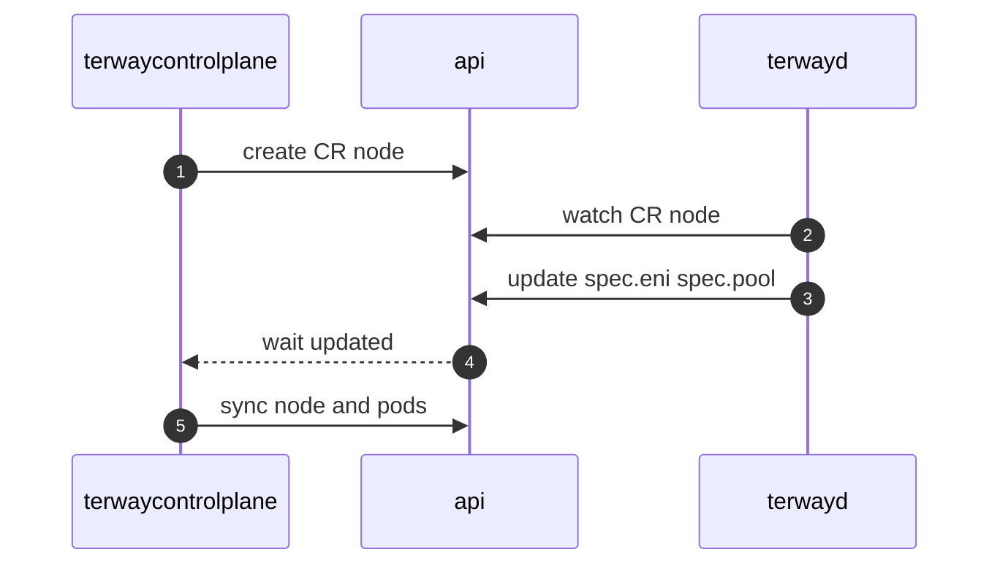

# Terway 中心化 IAPM

## 简介

之前 IAPM 设计是由 terway daemonSet 运行在每个节点上自主完成的。
有几个缺点：

- 数据面权限高： 每个节点都能操作 openAPI ，风险比较高。
- 流控管理：每个节点独立运作，不能做集群维度的流控管理。
- IPAM 记录可见性：不好观察 IPAM 记录，分配记录都在节点的 DB 里面。

## 基本流程

```mermaid
sequenceDiagram
    autonumber
    participant terwaycontrolplane
    participant api
    participant terwayd

    terwaycontrolplane ->> api: create CR node
    terwayd ->> api: watch CR node
    terwayd ->> api: update spec.eni spec.pool
    api -->> terwaycontrolplane: wait updated
    terwaycontrolplane ->> api: sync node and pods
```
