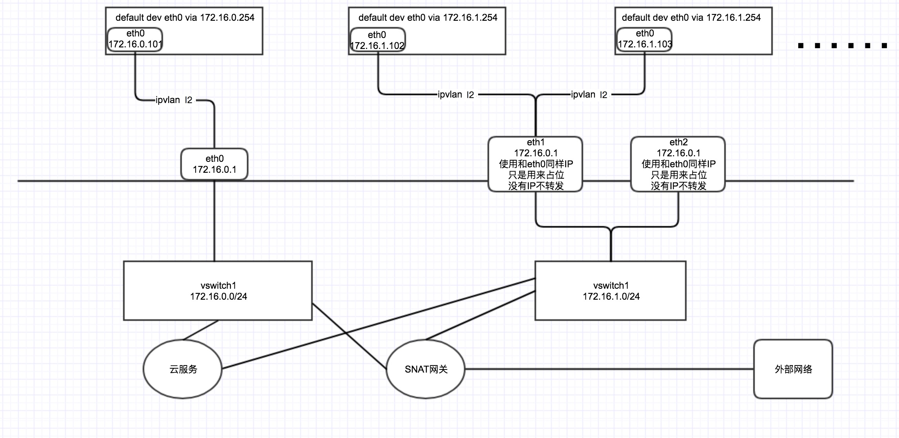

# Terway插件

Kubernetes有着种类丰富，数量繁多的网络插件，几乎任何场景，都能找到能用的网络插件。对于有追求的程序员来说，只是能用可不行，必须要选择最好的。很多时候，适合的才是最好的。

Terway是容器服务团队推出的针对阿里云VPC网络的CNI插件，稳定、高性能，支持Kubernetes network policy、流控等高级特性。

Terway的结构遵从业界的CNI设计方式，首先是标准的CNI接口，支持Kubernetes。内置了Network Policy和Traffic Control。

在Kubernetes场景下使用，支持Network Policies，可以实现Pod之间的访问隔离。

通过在Pod上声明`annotation:` `kubernetes.io/ingress-bandwidth`和`kubernetes.io/egress-bandwidth`可以限制Pod的入网和出网带宽。

## 架构设计与考虑

### 设计需要考虑的问题

* 不同网络方案中的网络连通性考虑，包括pod和pod，pod和service， pod和node，pod和外部网络
* binary和daemon组件职责划分，CNI的模式是通过binary调用，但binary中又做不了所有的事情
* 如何做到高效的IPAM和资源管理，容器的网络短暂异变，Terway网络联通性主要靠编排和配置各种底层的资源，如何高效的利用资源
* 需要考虑资源的限制，云厂商对网络的资源都有配额限制，如何让调度感知
* 异常处理，异常情况下如何避免垃圾资源和配置产生，上下游的调用时存在不一致的情况时如何保障资源状态

### Terway组件列表与交互

按照部署和调用方式划分，Terway包含[daemon](../daemon)和binary两部分(../plugin/terway)：

* daemon: 供`binary`调用，分配和管理网络资源
* binary：与`kubelet`交互及`daemon`交互，配置Pod的网络连接

当一个Pod被调度到节点上时，`Kubelet`监听到`Pod`创建在自己节点上时， 会通过`runtime(docker...)`创建`sandbox`容器来`hold`住各种`namespace`，然后通过`cni`调用`terway binary`来处理网络`namespace`，
`terway binary`调用`terway daemon`来获取网络资源，`terway daemon`调用`Aliyun Openapi`分配网络资源并返回给`terway binary`，最后`terway binary`为容器的网络`namespace`配置网络和联通网络。

### 不同资源类型的通信方案

Terway有多种容器网络的配置通信方式：

* VPC: Pod网段不同于节点的网络的网段，通过Aliyun VPC路由表打通不同节点间的容器网络。
* ENI: 容器的网卡是Aliyun弹性网卡，Pod的网段和宿主机的网段是一致的。
* ENI多IP：一个Aliyun弹性网卡可以配置多个辅助VPC的IP地址，将这些辅助IP地址映射和分配到Pod中，这种Pod的网段和宿主机网段也是一致的。

#### VPC

集群有一个大的和宿主机不同的Overlay的网段，比如宿主机的VPC网段是`172.16.0.0/16`的，那么Pod网段需要选择和宿主机不同的网段比如`192.168.0.0/16`网段。
`kube-controller-manager`会从`Pod`网段中为每个节点分配不同的`PodCidr`子段，每个节点上的Terway会从这个子段中为容器分配地址，
同时 `cloud-controller-manager` 会配置转发规则将每个节点的`PodCidr`字段转发到对应的节点上。

如图所示，Pod跟宿主机通过[Linux veth设备](http://man7.org/linux/man-pages/man4/veth.4.html)联通起来, Pod中路由将`default`路由指向了Pod内的`veth`网卡，
所以Pod内的流量都将经过Pod对端在宿主机上的`veth`，在宿主机的[`network namespace`](http://man7.org/linux/man-pages/man7/namespaces.7.html)上经过宿主机路由的转发通过宿主机的主网卡出去到VPC网络中，在VPC网络中经过自定义路由将子段转发到对应节点。
在宿主机的`network namespace`转发时，会经过宿主机上的`iptables`和`tc`来实现负载均衡、流量控制、地址转换等。

#### ENI

与VPC的网络模式不同，ENI和ENI多IP的网络都是和VPC同样的网段，ENI网络就是从Aliyun的VPC网络中创建和绑定一个[弹性网卡](https://help.aliyun.com/document_detail/58496.html)到节点上，
然后Pod利用这个弹性网卡和别的网络互通，这里需要关注的是弹性网卡的数量是有限制的，具体的根据[实例类型有不同的配额](https://help.aliyun.com/document_detail/25378.html)。

如图所示，Pod主网卡即是宿主机上绑定的弹性网卡挪到Pod的`network namespace`中的，Pod的`default`路由都指向了这个弹性网卡，所以Pod可以通过这个网卡直接跟VPC内的资源和公网的资源通信。
另外为了让Pod可以访问Service时可以经过宿主机的`network namespace`中的`iptables`规则，所以另外增加了一个`veth网卡`打通Pod和宿主机的网络，并将集群的`Service`网段指向到这个`veth`网卡上。

#### ENI多IP

弹性网卡(ENI)支持配置多个辅助IP的功能，单个弹性网卡(ENI)根据实例规格可以分配6-20个辅助IP，ENI多IP模式就是利用了这个辅助IP分配给容器，从而大幅提高了Pod部署的规模和密度。在网络联通的方式上，Terway支持选择`Vethpair`策略路由和`ipvlan l3s`两种方案，Terway主要考虑了这些：

1. 在节点上如何把弹性网卡(ENI)的辅助IP的流量都走对应的弹性网卡出去，并使用弹性网卡本身的mac地址而不被丢包
2. 如何兼容容器服务目前广泛的`Centos 7.x`的`3.10`的版本的内核

##### veth策略路由

如图所示，pod的网卡和VPC路由方式的网卡类似，都是一对`veth pair`来联通宿主机和pod的网络空间，但是和vpc路由方式的pod的区别在，pod的地址是来源于弹性网卡的辅助IP地址，并且节点上需要配置策略路由来保证辅助IP的流量经过它所属的弹性网卡。

* 同主机上的容器通信直接通过主机上的路由到同一个主机上别的容器对应的veth上
* 不同主机的容器通信经过VPC的网络进行转发到对应的机器上，再通过机器上的路由转发到容器中
* 容器和其所在的宿主机之间的通信直接通过连接到宿主机`namespace`的veth pair和路由打通
* 容器到其他主机通过VPC的网络转发到对应的机器，其他主机到容器通过VPC网络转发到对应的弹性网卡，然后通过路由转发到容器的Veth上
* 容器到专线和共享服务也都是通过VPC的网络转发
* 容器到公网的访问经过VSwitch配置的SNAT网关直接将源IP转换成EIP的地址到外部网络

##### `ipvlan l2`

Linux在4.2以上的内核中支持了[ipvlan](https://www.kernel.org/doc/Documentation/networking/ipvlan.txt)的虚拟网络，可以实现单个网卡虚拟出来多个子网卡用不同的IP地址，而Terway便利用了这种虚拟网络类型，将弹性网卡的辅助IP绑定到IPVlan的子网卡上来打通网络，使用这种模式使ENI多IP的网络结构足够简单，性能也相对veth策略路由较好。

### 资源管理和分配

Terway中管理和分配给Pod的网络资源是阿里云虚拟化底层的网络资源，网络资源的创建都需要一系列的API调用，所以需要一些机制来保障资源的高效利用和快速分配，Terway资源管理设计如下：

#### Pod资源管理

在给Pod分配网络资源时，`Terway`的资源管理中会记录Pod和资源的关联状态以及资源的租期。当有租期的Pod释放网络资源时根据租期保留其对应的网络资源，超时后才会到资源池中释放。
通过资源管理的办法可以实现`Statefulset`的Pod在更新过程中IP地址保持不变，也可以通过垃圾回收的机制，避免`Kubelet`在`Pod`释放时未调用`CNI`导致的资源泄露。

#### 资源池化

Terway使用底层虚拟化底层的网络资源打通容器网络，网络资源的创建和释放需要一系列的API调用，如果在Pod创建销毁时调用API会导致Pod配置时间较长。
Terway通过池化的方式对资源进行缓存，当小于资源的池的最小水位时自动补充资源，在大于资源池最大水位时开始释放资源，这样保障了高效的资源利用和分配的效率。

#### 调度

阿里云的网络资源在不同类型的机器上是有不同配额的，比如`ecs.g6.xlarge`机型只能额外绑定2个辅助网卡，如果是`Pod`独占辅助网卡只能调度两个`Pod`。
如何让`Kubernetes`的调度感知到配额，避免调度超过节点可分配网卡数量的`Pod`，`Terway`通过[`DevicePlugin`](https://kubernetes.io/docs/concepts/extend-kubernetes/compute-storage-net/device-plugins/)的机制上报节点上支持的弹性网卡数量，Pod可以通过声明`aliyun/eni: 1`的资源需求来让调度感知到网卡的配额。

### Network Policy

在基于`Veth`的`VPC`和`ENI多IP的策略路由`模式中Terway的NetworkPolicy是通过集成Calico的[Felix](https://github.com/projectcalico/felix)组件来实现
在基于`IPvlan`的`ENI多IP的IPvlan`模式中Terway的NetworkPolicy是通过集成[Cilium](https://github.com/cilium/cilium)组件来实现

### Pod流量控制

`Terway`会取到Pod上的`ingress`和`egress`的`annotation`配置，然后通过配置`Pod`的网卡上的`TC`的`tbf`规则来实现对速度的限制。
