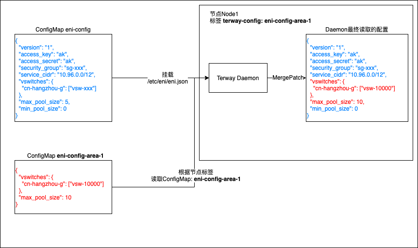

# Terway 节点动态配置

Terway的配置文件是作为 `ConfigMap` 资源对象存放在 `etcd` 中(默认名称为 `eni-config` )。其内容如下：

```json
{
  "version": "1",
  "access_key": "ak",
  "access_secret": "ak",
  "security_group": "sg-xxx",
  "service_cidr": "10.96.0.0/12",
  "vswitches": {
    "cn-hangzhou-g": ["vsw-xxx"]
  },
  "max_pool_size": 5,
  "min_pool_size": 0
}
```

| 名称             | 描述                          |
| ---------------- | ----------------------------- |
| `version`        | 版本                          |
| `access_key`     | `AccessKey`                   |
| `access_secret`  | `AccessSecret`                |
| `security_group` | 安全组ID                      |
| `service_cidr`   | 服务CIDR(使用`ipvlan`时)      |
| `vswitches`      | 关联的虚拟交换机(ENI多IP模式) |
| `max_pool_size`  | 资源池最大水位                |
| `min_pool_size`  | 资源池最小水位                |

关于terway的资源管理机制可见[此处](https://github.com/AliyunContainerService/terway/blob/master/docs/design.md#资源管理和分配)。

该 `ConfigMap` 将挂载入 terway daemon 的Pod中，并在 daemon 启动时读取。下文中将其称为**默认配置**。

除此之外，Terway 还加入通过label为单节点指定**动态配置文件**的功能。

在节点标签中加入：

`terway-config: <config_name>`

daemon 在**启动时**会获得配置文件名，并获取**同命名空间下**的 `ConfigMap`: `<config_name>`

并以其中的`eni_conf`值作为动态配置

(如 `terway-config`:  `eni-config-node1` 则会获取 `eni-config-node1` 作为动态配置的 `ConfigMap`)

获取到的该动态配置将会以[`MergePatch`](https://tools.ietf.org/html/rfc7396)的形式合并到默认配置上。

如动态配置为：

```json
{
  "vswitches": {
    "cn-hangzhou-g": ["vsw-10000"]
  },
  "max_pool_size": 10
}
```

默认配置如上，则最终 daemon 中读取的配置为：

```json
{
  "version": "1",
  "access_key": "ak",
  "access_secret": "ak",
  "security_group": "sg-xxx",
  "service_cidr": "10.96.0.0/12",
  "vswitches": {
    "cn-hangzhou-g": ["vsw-10000"]
  },
  "max_pool_size": 10,
  "min_pool_size": 0
}
```



> 注：若在现有节点上设置或更换动态配置，需要对daemon进行重启才能够应用。且daemon之前已经申请到的与配置相关的资源（如ENI等）可能仍旧会保留在daemon中。

可以结合阿里云[容器服务控制台](https://cs.console.aliyun.com/)的节点池功能，批量为多个节点指定不同配置，达到对集群中不同节点的网络分划、资源水位调节、访问控制等精细化配置。

## 关于合并配置

terway 使用了 [`json-patch`](https://github.com/evanphx/json-patch) 库来对配置进行合并，其实现了 RFC7396 中声明的 `MergePatch` 过程。

当遇到多层嵌套的 Object 结构时，也会进行部分合并。如默认配置(部分)

```json
{
    "vswitches": {
      "cn-hangzhou-g": ["vsw-xxx"],
      "cn-hangzhou-i": ["vsw-yyy"]
  }
}
```

应用动态配置

```json
{
    "vswitches": {
      "cn-hangzhou-g": ["vsw-10000"]
  }
}
```

时，最终得到的结果为

```json
{
    "vswitches": {
      "cn-hangzhou-g": ["vsw-10000"],
      "cn-hangzhou-i": ["vsw-yyy"]
    }
}
```

若要移除 `cn-hangzhou-i`，请设置动态配置为

```json
{
    "vswitches": {
      "cn-hangzhou-g": ["vsw-10000"],
      "cn-hangzhou-i": null
  }
}
```
