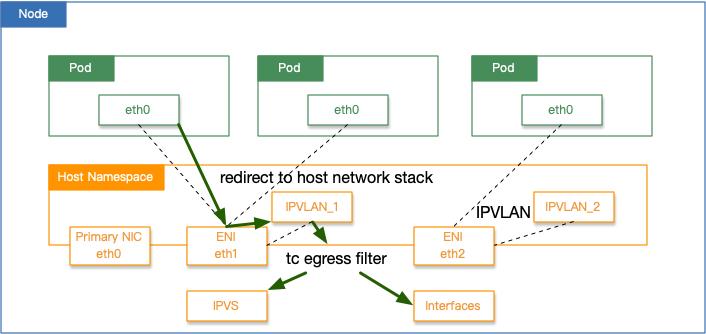

# Terway 主机网络栈路由

## 背景

- 在 Terway IPVLAN 模式中，使用 Terway 网络的 Pod 网络流量会被转发至主机网络中 IPVLAN 接口，通过其 `tc egress filter` 策略转发流量。
- 默认情况下，`tc egress` 仅会将 `ServiceCIDR` 的流量转发至主机网络栈，交由 IPVS 等策略进行处理。如果希望将部分网段额外路由至主机网络栈，您可以参考本文进行设置。
- 常见场景：DNS 缓存方案 `node-local-dns` 中，Local DNS 缓存作为 DaemonSet 部署在每个集群节点上，通过 Link-Local Address 暴露缓存服务。如需在 IPVLAN 模式下使用本地
  DNS 缓存，可以将 Link-Local Address 设置到主机网络栈路由中。
- 在 Terway ENIONLY 模式中，使用 Terway 网络的 Pod 中会默认添加 `ServiceCIDR` 路由至主机，通过设置主机网络栈，可以将指定网络同样路由至主机，配置方式同下。



## 操作流程

1. 执行以下命令，打开 Terway 配置文件修改

    ```bash
    kubectl -n kube-system edit cm eni-config -o yaml
    ```

2. 可以看到默认的配置包含以下内容，如需增加主机网络栈路由，请添加 `host_stack_cidrs` 字段，并填入需要转发的网段，保存退出

    ```json
      10-terway.conf: |
      {
        "cniVersion": "0.4.0",
        "name": "terway",
        "eniip_virtual_type": "IPVlan",
        "host_stack_cidrs": ["169.254.0.0/16"], // 此处为您希望添加的主机网络栈路由
        "type": "terway"
      }
    ```

3. 执行以下命令，过滤出当前 Terway 的所有 DaemonSet 容器组

    ```bash
    kubectl -n kube-system get pod | grep terway-eniip
    terway-eniip-7d56l         2/2     Running   0          30m
    terway-eniip-s7m2t         2/2     Running   0          30m
    ```

4. 执行以下命令，触发 Terway 容器组重建

   ```bash
    kubectl -n kube-system delete pod terway-eniip-7d56l terway-eniip-s7m2t
   ```

5. 登录任意集群节点，执行以下命令，查看 Terway 配置文件，如果包含添加的网段，则说明变更成功

   ```bash
    cat /etc/cni/net.d/*
    {
      "cniVersion": "0.4.0",
      "name": "terway-chainer",
      "plugins": [
        {
          "eniip_virtual_type": "IPVlan",
          "host_stack_cidrs": [ // 此处为新增的主机网络栈路由
            "169.254.0.0/16",
          ],
          "type": "terway"
        },
        {
          "type": "cilium-cni"
        }
      ]
    }
    ```

6. 重建任意一个使用 Terway 网络的 Pod 后，Pod 所在节点即可在容器中访问该新网段。
