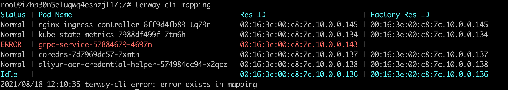

# Terway CLI 使用文档

## 介绍

为了增强`terway`组件的可观测性，便于在出现问题时能够快速定位问题，在terway的pod中打包了二进制调试工具`terway-cli`，可以在运行时通过`gRPC`向`terway daemon`拉取关键信息。

## 设计

在terway daemon中增加了tracing组件，daemon中的关键组件(`network_service，pool, factory`等)注册到tracing组件中，并且通过接口来提供关键信息或是执行命令。同时，tracing组件提供了对外的`gRPC`接口来与`terway-cli`通信。

为了保证之后的可扩展性和兼容性，tracing中的组件按照`(type, resource_name)`的形式注册。

## 命令

目前，在`terway-cli`中提供了5个可用命令

- **`list [type]`**- 列出目前已注册的所有资源的类型，如果指定了类型，则列出该类型的所有资源

- **`show <type> [resource_name]`**- 获得某一资源的配置和追踪信息。如果没有指定资源名称，则默认选择该类型下的第一个资源。资源的具体信息解释请见文档底部。

- **`mapping`** - 获得Pod -- Pool -- Factory(Aliyun API)的资源对应关系。

  当使用mapping时，结果可能会出现以下几种情况

  - 正常(白色) - 资源映射关系正常，并有Pod正在使用该资源
  - 空闲(蓝色) - 资源映射关系正常，没有Pod正在使用该资源
  - 错误(红色) - 资源映射关系出错 (Pool和Factory的资源无法一一对应)

  当出现错误时，`terway-cli`会以 error exists in mapping 错误结束程序，并返回error code为1。

  

- **`execute <type> <resource_name> <command> args...`**  - 在某一资源上执行定义的命令

  目前在所有资源上存在mapping命令，以查看当前层的资源映射清单。在`eniip factory`上存在audit指令，进行本地多IP工厂资源与阿里云API资源的对账功能。

  因为可以直接使用mapping命令代替这两者的功能，所以不推荐直接使用。
  
- **`metadata`** - 通过`metadata`获得资源信息

  使用该指令，可以查询`ECS metadata API`返回的网络资源，以树的形式呈现。该命令用于检视`metadata`内资源是否与本地资源相对应。

   

## 资源配置与追踪信息

目前已经注册的信息有

- `network_service`
  - `name` - 名称
  - `daemon_mode` - `daemon`的运行模式(`ENIMultiIP、ENIOnly、VPC`)
  - `config_file_path` - 配置文件路径
  - `kubeconfig` - `k8s`的配置路径
  - `master` - `k8s`的master地址，如果与`kubeconfig`同时为空，则自动获取
  - `pending_pods_count` - 等待申请的Pod数量
  - `pods`: 各个Pod的资源分配情况
- `resource_pool`
  - `name` - 名称
  - `max_idle` - 最多保有空闲资源数(最高水位)
  - `min_idle` - 最少保有空闲资源数(最低水位)
  - `idle` - 当前空闲的资源
  - `inuse` - 当前正在使用的资源
- `factory(eniip)`
  - `name` - 名称
  - `eni_max_ip` - 每个ENI能够拥有的最大IP数
  - `primary_ip` - 主IP
  - `eni_count` - 目前拥有的ENI数量
  - `secondary_ip_count` - 目前拥有的辅助IP数量
  - `eni`
    - `pending` - 等待申请的IP数量
    - `secondary_ips` - 目前该ENI上的辅助IP
    - `ip_alloc_inhibit_expire_at` - 禁用IP申请过期时间
- `factory(eni)`
  - `name` - 名称
  - `vswitches` - 拥有的虚拟交换机数量
  - `vswitch_selection_policy` - 交换机选择策略
  - `cache_expire_at` - 交换机列表缓存过期时间
  - `vswitch`
    - `ip_count` - 可分配的IP数
