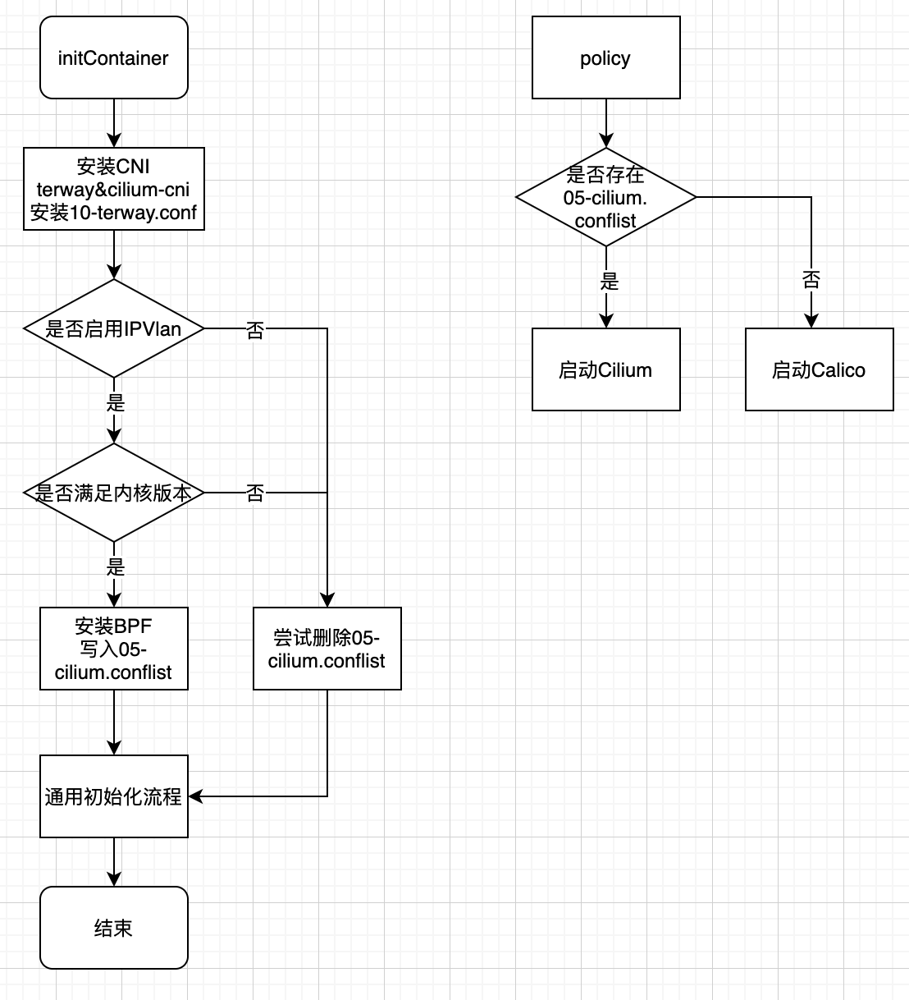

# Terway + Cilium整合文档

## 考虑

- 我们基本只使用 `Cilium` 的路由和网络策略功能，将 `Cilium` 的全部组件一起运行比较多余
- `IPVLan` 和 `eBPF` 都对内核版本有要求，应该做一些判断
- Terway的不同网络模式( `Veth/IPVlan/IPVlan+Cilium` )是否能够在同一集群中共存，并且保证连通性
- Plugin Chaining 的最小 `CNI` 版本为 `3.0` ，如果版本不满足条件，是否有兼容措施
- 不同网络模式之间的切换是否简单
- 对 `Terway` 部署的改动尽量小，并且使用同一个镜像便于分发

## 设计

在`IPVlan`模式，基于`Calico`的网络策略失效，并且`Cilium`具有网络策略的相关功能。

可以将 `Cilium` 放入 `policy` 容器，通过启动脚本来判断应该启动 `Calico` 或是 `Cilium` ；同时，`Cilium` 的运行还需要安装`BPF` ，生成对应的 `conflist`  文件等步骤，可以在初始化容器中完成这些工作。



除此之外，为了保证低内核版本下的兼容性(创建网络时不会出现错误)，在 `Terway CNI` 中还需要加入额外的判断，在不满足IPVlan要求的情况下回退到策略路由模式，并以 `Pod Event` 的形式上报。

## 使用流程

- 安装支持 `Cilium` 的 `Terway` 版本(修改并应用仓库目录下的 `charts/terway` )

```shell
helm package charts/terway -d charts

helm install terway charts/terway --namespace kube-system --set enableIPvlan=true
```

- 重启节点以应用配置

## 验证计划

- `Veth` 模式连通性正常，`network_policy` 开关正常
- 切换到 `IPVlan` 之后连通性正常，`network_policy` 开关正常
- 切换回 `Veth` 模式连通性正常
- 在低内核版本下(`CentOS 7`)触发配置回退

## 问题

- 需要重启节点
- 由于 `Cilium` 需要的库较多，更换 `ubuntu` 镜像打包后体积由180MB到了500+MB
- 丢弃了 `Cilium` 的较多组件(`Operator`、`Envoy Proxy`、基于 `ConfigMap` 的配置)，稳定性需要进一步测试

## 之后的工作

- 针对ENI独占模式的 `Cilium` 整合
- `Cilium` 的大部分组件在当前场景下不需要，能否单独将 `routing` 和 `network policy`部分抽出
- `Cilium` 的参数能否透出给客户进行修改
- 在大规模集群上需要做进一步的性能测试
- Override kernel版本检查
