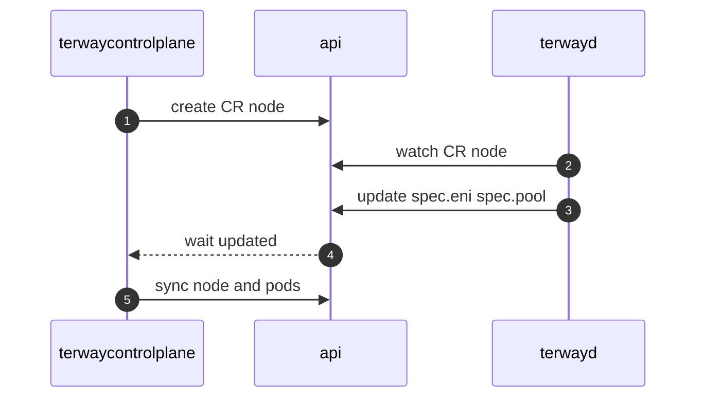

# Centralized IPAM

Centralized IP Address Management (IPAM) is an advanced feature in Terway that centralizes IP allocation and management to improve security, visibility, and control.

## Overview

Traditional IPAM design had Terway DaemonSet running on each node performing autonomous IP management. This approach had several drawbacks:

- **High data plane privileges**: Each node could operate OpenAPI, creating security risks
- **Flow control management**: Independent node operation prevented cluster-wide flow control
- **IPAM record visibility**: Difficult to observe IPAM records as allocation records were stored in local node databases

Centralized IPAM addresses these issues by moving IP allocation logic to a centralized control plane.

## Architecture

The centralized IPAM architecture separates concerns between the control plane and data plane:

### Control Plane (terway-controlplane)
- Manages IP allocation and deallocation
- Communicates with Alibaba Cloud APIs
- Maintains cluster-wide IPAM state
- Handles resource quota and flow control

### Data Plane (terway daemon)
- Requests IP allocations from control plane
- Configures network interfaces
- Reports resource status
- Handles CNI operations

## Basic Flow



## Benefits

### 1. Enhanced Security
- **Reduced privileges**: Only control plane needs cloud API access
- **Principle of least privilege**: Nodes only need local network configuration rights
- **Centralized auditing**: All API operations logged centrally

### 2. Better Visibility
- **Centralized monitoring**: All IPAM operations visible from control plane
- **Resource tracking**: Cluster-wide view of IP allocation and usage
- **Operational insights**: Better understanding of resource utilization patterns

### 3. Improved Control
- **Flow control**: Cluster-wide rate limiting and quota management
- **Policy enforcement**: Centralized policy application
- **Resource optimization**: Better resource pooling and allocation strategies

## Configuration

### Enabling Centralized IPAM

To enable centralized IPAM, set the following in your Terway configuration:

```yaml
apiVersion: v1
kind: ConfigMap
metadata:
  name: eni-config
  namespace: kube-system
data:
  eni_conf: |
    {
      "version": "1",
      "centralized_ipam": true,
      "access_key": "your-access-key",
      "access_secret": "your-access-secret",
      "security_group": "sg-xxxxxxxxx",
      "service_cidr": "10.96.0.0/12",
      "vswitches": {
        "cn-hangzhou-a": ["vsw-xxxxxxxxx"],
        "cn-hangzhou-b": ["vsw-yyyyyyyyy"]
      }
    }
```

### Control Plane Deployment

Deploy the Terway control plane:

```yaml
apiVersion: apps/v1
kind: Deployment
metadata:
  name: terway-controlplane
  namespace: kube-system
spec:
  replicas: 2
  selector:
    matchLabels:
      app: terway-controlplane
  template:
    metadata:
      labels:
        app: terway-controlplane
    spec:
      containers:
      - name: controlplane
        image: registry.cn-hangzhou.aliyuncs.com/acs/terway:latest
        command:
        - /usr/bin/terway-controlplane
        env:
        - name: CLUSTER_ID
          value: "your-cluster-id"
        - name: REGION_ID
          value: "cn-hangzhou"
```

## Resource Management

### Custom Resource Definitions

Centralized IPAM introduces several CRDs:

#### Node Resource
```yaml
apiVersion: terway.aliyun.com/v1
kind: Node
metadata:
  name: node-1
spec:
  eni:
    - id: eni-12345
      primary_ip: "192.168.1.10"
      secondary_ips:
      - "192.168.1.11"
      - "192.168.1.12"
  pool:
    max_size: 10
    min_size: 2
status:
  eni_count: 1
  ip_count: 3
  allocated_ips: 1
```

#### PodENI Resource
```yaml
apiVersion: terway.aliyun.com/v1
kind: PodENI
metadata:
  name: pod-eni-12345
spec:
  pod_name: "my-pod"
  namespace: "default"
  eni_id: "eni-12345"
  ip: "192.168.1.11"
status:
  phase: "Allocated"
```

### Resource Lifecycle

1. **Node Registration**: Nodes register with control plane on startup
2. **Resource Discovery**: Control plane discovers existing cloud resources
3. **Pool Management**: Control plane maintains IP pools per node
4. **Allocation**: Pods request IPs through control plane
5. **Cleanup**: Control plane handles resource cleanup and recycling

## Monitoring and Observability

### Metrics

Centralized IPAM exposes additional metrics:

- `terway_controlplane_ip_allocations_total` - Total IP allocations
- `terway_controlplane_ip_pool_size` - Current IP pool size per node
- `terway_controlplane_api_requests_total` - Cloud API request count
- `terway_controlplane_allocation_latency` - IP allocation latency

### Logging

Control plane logs provide visibility into:

- IP allocation and deallocation events
- Cloud API interactions
- Resource reconciliation activities
- Error conditions and retry attempts

### Dashboard

Monitor centralized IPAM through Grafana dashboards:

```json
{
  "dashboard": {
    "title": "Terway Centralized IPAM",
    "panels": [
      {
        "title": "IP Pool Utilization",
        "type": "graph",
        "targets": [
          {
            "expr": "terway_controlplane_ip_pool_size"
          }
        ]
      }
    ]
  }
}
```

## Troubleshooting

### Common Issues

#### Control Plane Not Available
```bash
# Check control plane status
kubectl get pods -n kube-system -l app=terway-controlplane

# Check logs
kubectl logs -n kube-system -l app=terway-controlplane
```

#### IP Allocation Failures
```bash
# Check node resource status
kubectl get nodes.terway.aliyun.com

# Check pod ENI status
kubectl get podenis.terway.aliyun.com
```

#### Resource Synchronization Issues
```bash
# Force reconciliation
kubectl annotate node <node-name> terway.aliyun.com/reconcile=true
```

### Degradation Mode

When the control plane is unavailable, Terway can operate in degradation mode:

- **L0 Degradation**: Stop all API requests, use cached resources only
- **L1 Degradation**: Stop resource release requests, continue allocation requests

Configure degradation thresholds:

```yaml
degradation:
  enable: true
  l0_threshold: 10  # API error rate percentage
  l1_threshold: 5   # API error rate percentage
```

## Migration

### From Distributed to Centralized IPAM

1. **Prepare**: Ensure control plane is deployed and healthy
2. **Enable**: Set `centralized_ipam: true` in configuration
3. **Restart**: Rolling restart Terway DaemonSet
4. **Verify**: Confirm all nodes register with control plane
5. **Monitor**: Watch for any allocation issues

### Rollback Procedure

If issues occur, rollback by:

1. **Disable**: Set `centralized_ipam: false`
2. **Restart**: Rolling restart Terway DaemonSet
3. **Cleanup**: Remove control plane deployment if needed

## Best Practices

1. **High Availability**: Deploy control plane with multiple replicas
2. **Resource Limits**: Set appropriate CPU/memory limits for control plane
3. **Monitoring**: Monitor control plane health and API usage
4. **Gradual Rollout**: Test in staging before production deployment
5. **Backup**: Backup IP allocation state before major changes

## See Also

- [Degradation Mode](../docs/degradation.md) - Detailed degradation behavior
- [Dynamic Configuration](Dynamic-Configuration.md) - Runtime configuration changes
- [Monitoring](Metrics.md) - Monitoring and alerting setup